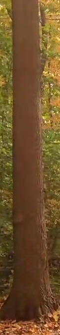

# Offroad Tree Dataset Augmentation

Since the offroad tree dataset is limited, this script allows you to generate an extended dataset by applying various image transformations. Users can create their own dataset using this script, which reads images from a source directory, splits them into four different classes, and applies unique transformations to each class.

## Example Transformed Images

Here are some sample transformations shown side by side:

| **Art Painting** | **Sketch** | **Photo** | **Cartoon** |
|:----------------:|:----------:|:----------------:|:-----------:|
|  |  |  |  |

For more examples see sample dataset
## Table of Contents

- [Overview](#overview)
- [Requirements](#requirements)
- [Installation](#installation)
- [Usage](#usage)
- [Transformation Details](#transformation-details)
  - [Photo](#photo)
  - [Sketch](#sketch)
  - [Art Painting (Oilify)](#art-painting-oilify)
  - [Cartoon](#cartoon)
- [Output Structure](#output-structure)
- [License](#license)

## Overview

The script (`transform.py`) processes an initial dataset of offroad tree images by randomly splitting and transforming them into four distinct classes:
- **Photo**: Original images are copied without modification.
- **Sketch**: Images are converted to a pencil sketch style using TensorFlow GPU acceleration.
- **Art Painting (Oilify)**: An oil painting effect is applied using randomized elliptical brush strokes.
- **Cartoon**: A cartoon-style transformation is performed by smoothing colors, detecting edges, and applying color quantization.

This approach helps augment the limited dataset and provides a variety of image styles for further analysis or training.

## Requirements

Ensure you have the following installed:
- **Python 3.x**

### Python Libraries:
- TensorFlow
- OpenCV (`cv2`)
- NumPy
- scikit-image
- Matplotlib
- SciPy

Standard libraries used:
- os, random, shutil, pathlib, collections

You can install the non-standard libraries using pip:

```bash
pip install tensorflow opencv-python numpy scikit-image matplotlib scipy
